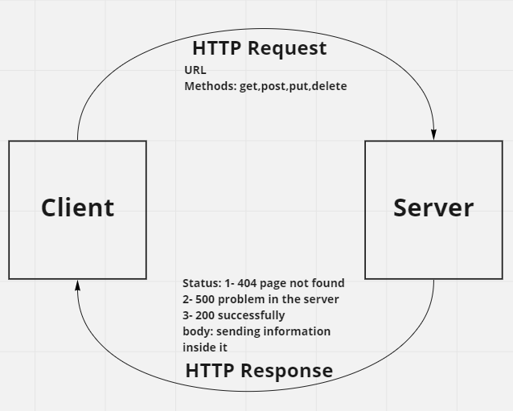

# Movies-Library

# Project Name: 
Movies-Library
 
# Project Version:
 1.0.0

**Author Name**: Laila Nouman

## WRRC

## Overview
building a server with express framework

## Getting Started
1- npm init
2- create a js file with same name we put in init
3- npm install express
4- require the package
5- create express application 
6- declare a port
7- make the server listen to the port

## Project Features
I have a home page that display an information about specific movie, i have a favorite page whenever the user clicks on it it shows him a msg of "Welcome to the favorite page".